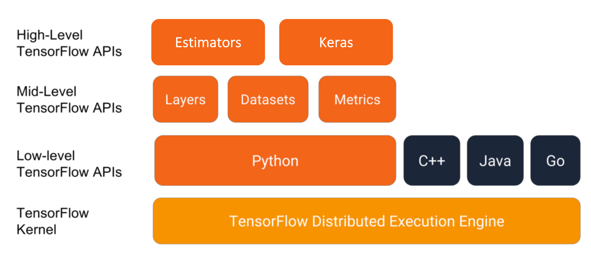
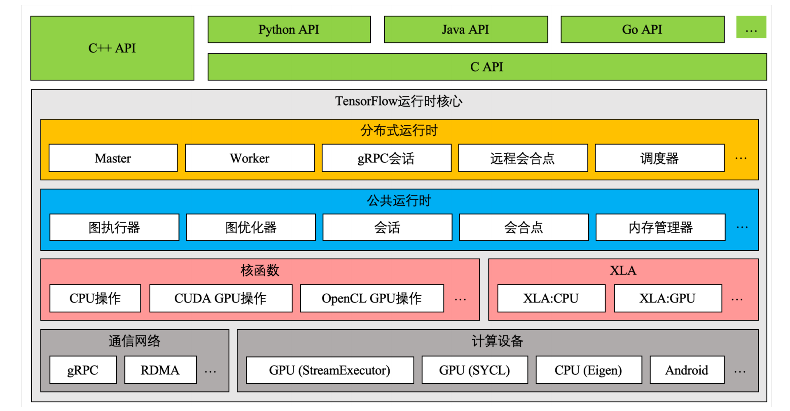
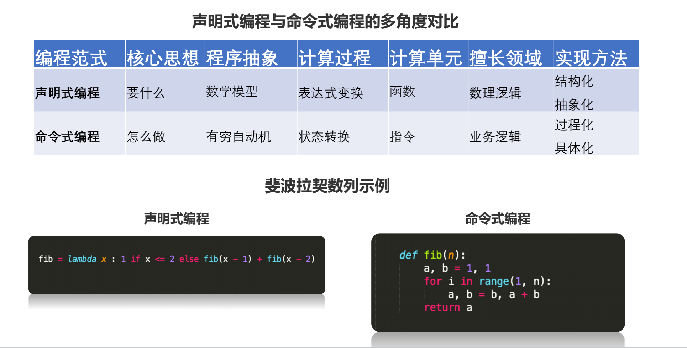
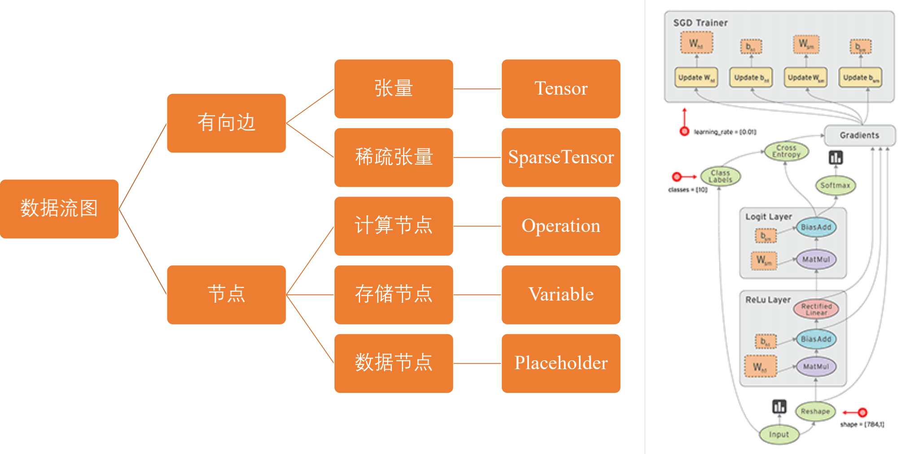
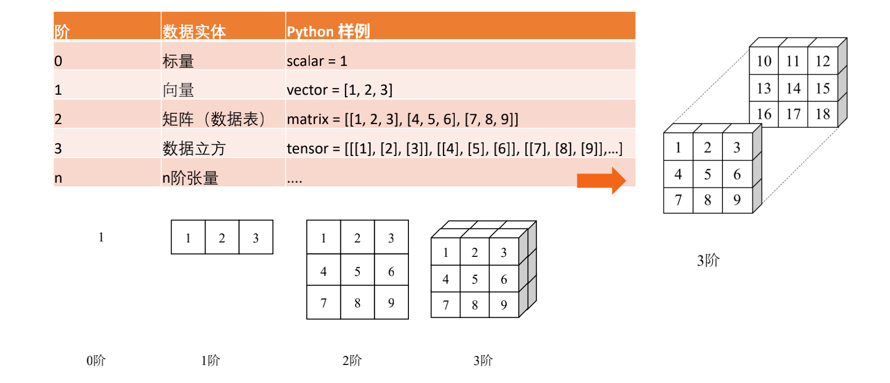
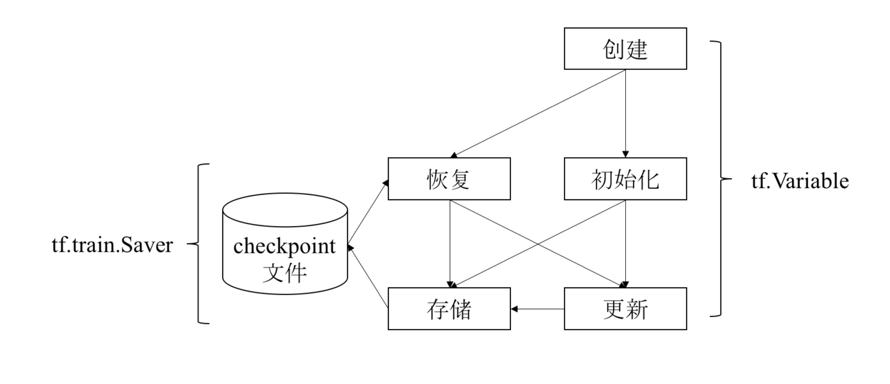
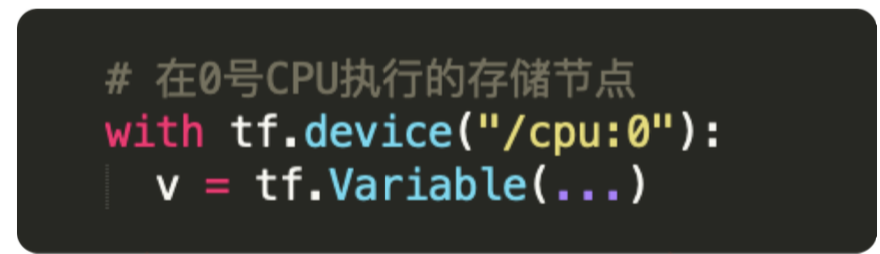
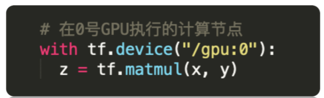

# TensorFlow-learn

## 1. 安装环境

### 1.1. 安装python开发环境

安装python：  
brew install python@2  

安装pip：  
curl https://bootstrap.pypa.io/get-pip.py -o get-pip.py  
sudo python get-pip.py  
sudo pip install -U virtualenv  

### 1.2. 创建python虚拟环境

virtualenv --system-site-packages -p python2.7 ./venv  
source ./venv/bin/active  
pip install --upgrade pip  
pip list  

之后可以使用以下命令退出 virtualenv：  
deactivate  

### 1.3. 安装TensorFlow包

pip install --upgrade tensorflow

## 2. TensorFlow基础概念解析

### 2.1. TensorFlow模块与架构介绍

TensorFlow 模块与 APIs  
  

TensorFlow 架构  
  

### 2.2. TensorFlow数据流图介绍

TensorFlow数据流图是一种声明式编程范式  

  


TensorFlow数据流图优势：  

- 并行计算快
- 分布式计算快(CPUs, GPUs TPUs)
- 预编译优化(XLA)
- 可移植性好(Language-independent representation)

### 2.3. 张量Tensor

在数学里，张量是一种几何实体，广义上表示任意形式的“数据”，张量可以理解为0阶标量，1阶向量和2阶矩阵在高维空间上的推广，张量的阶描述它表示数据的最大维度。



tf.Tensor是TensorFlow.js中的最重要的数据单元，它是一个形状为一维或多维数组组成的数值的集合。tf.Tensor和多维数组其实非常的相似。  

一个tf.Tensor还包含如下属性:  

rank: 张量的维度  
shape: 每个维度的数据大小  
dtype: 张量中的数据类型  

可以用tf.tensor()方法将一个数组(array)创建为一个tf.Tensor：  

```js
// 从一个多维数组创建一个rank-2的张量矩阵
const a = tf.tensor([[1, 2], [3, 4]]);
console.log('shape:', a.shape);
a.print();
// 或者您可以用一个一维数组并指定特定的形状来创建一个张量
const shape = [2, 2];
const b = tf.tensor([1, 2, 3, 4], shape);
console.log('shape:', b.shape);
b.print();
```

在默认的情况下，tf.Tensor的数据类型也就是 dtype为32位浮点型(float32)。当然tf.Tensor也可以被创建为以下数据类型：布尔(bool), 32位整型(int32), 64位复数(complex64), 和字符串(string)：  

```js
const a = tf.tensor([[1, 2], [3, 4]], [2, 2], 'int32');
console.log('shape:', a.shape);
console.log('dtype', a.dtype);
a.print();
```

#### 修改张量的形状  

tf.Tensor中的元素数量是这个张量的形状的乘积(例如一个形状为[2,3]的张量所含有的元素个数为2*3=6个)。所以说在大部分时候不同形状的张量的大小却是相同的,那么将一个tf.Tensor改变形状(reshape)成为另外一个形状通常是有用且有效的。上述操作可以用reshape() 方法实现:  

```js
const a = tf.tensor([[1, 2], [3, 4]]);
console.log('a shape:', a.shape);
a.print();

const b = a.reshape([4, 1]);
console.log('b shape:', b.shape);
b.print();
```

#### 获取张量的值

可以使用Tensor.array() or Tensor.data()这两个方法:  

```js
 const a = tf.tensor([[1, 2], [3, 4]]);
 //返回多维数组的值
 a.array().then(array => console.log(array));
 // 返回张量所包含的所有值的一维数组
 a.data().then(data => console.log(data));
```

### 2.4. 变量Variable

TensorFlow变量(Variable)的主要作用是维护特定节点的状态，如深度学习或机器学习的模型参数。  
tf.Variable方法是操作，返回值是变量（特殊张量）。  

通过tf.Variable方法创建的变量与张量一样，可以作为操作的输入和输出。不同在于：  

- 张量的生命周期通常随依赖的计算完成而结束，内存也随即释放。
- 变量则常驻内存，在每一步的训练时不断更新其值，以实现模型参数的更新。  

```js
const x = tf.variable(tf.tensor([1, 2, 3]));
x.assign(tf.tensor([4, 5, 6]));

x.print();
```

TensorFlow变量使用流程



### 2.5. 操作Operation

#### TensorFlow用数据流图表示算法模型，数据流图由节点和有向边组成，每个节点均对应一个具体的操作。因此操作是模型功能的实际载体

数据流图中的节点按照功能不同可以分为三种：

- 存储节点：有状态的变量操作，通常用来存储模型参数；
- 计算节点：无状态的计算或控制操作，主要负责算法逻辑表达或流程控制；
- 数据节点：数据的占位符操作，用于描述图外输入数据的属性。  

#### TensorFlow典型计算和控制操作

| 操作类型 | 典型操作 |
| ------ | ------ |
| 基础算术 | add/multiply/mod/sqrt/sin/trace/fft/argmin |
| 数组运算 | size/rank/split/reverse/cast/one_hot/quantize |
| 梯度裁剪 | clip_by_value/clip_by_norm/clip_by_global_norm |
| 逻辑控制和调试 | identity/logical_and/equal/less/is_finite/is_nan |
| 数据流控制 | enqueue/dequeue/size/take_grad/apply_grad/ |
| 初始化操作 | zeros_initializer/random_normal_initializer/orthogonal_initializer |
| 神经网络运算 | convolution/pool/bias_add/softmax/dropout/erosion2d |
| 随机运算 | random_normal/random_shuffle/multinomial/random_gamma |
| 字符串运算| string_to_hash_bucket/reduce_join/substr/encode_base64 |
| 图像处理运算| encode_png/resize_images/rot90/hsv_to_rgb/adjust_gamma |

#### TensorFlow 占位符操作

TensorFlow使用占位符操作，表示图外输入的数据，如训练和测试数据。  

TensorFlow数据流图描述了算法模型的计算拓扑，其中的各个操作（节点）都是抽象的函数映射或数学表达式。  

### 2.6. 会话Session

会话提供了估算张量和执行操作的运行环境，他是发放计算任务的客户端，所有计算任务，都由他连接的执行引擎完成。一个会话的典型使用流程分为以下3步：

1. 创建会话

```ts
sess = tf.Session(target=...,graph=...,config=...)
```

| 参数名称 | 功能说明 |
| ------ | ------ |
| target | 会话连接的执行引擎 |
| graph | 会话加载的数据流图 |
| config | 会话启动时的配置项 |

2. 估算张量或执行操作

```ts
sess.run(...)
```

3. 关闭会话

```ts
sess.close()
```

#### TensorFlow会话执行原理

当我们调用sess.run 语句执行训练操作时：

- 首先，程序内部提取操作依赖的所有前置操作。这些操作的节点共同组成一幅子图。

- 然后，程序会将子图中的计算节点、存储节点和数据节点按照各自的执行设备分类，相同设备上的节点组成一幅子图。

- 最后，每个设备上的局部图在实际执行时，根据节点间的依赖关系将各个节点有序地加载到设备上执行。

#### TensorFlow会话本地执行

对于单机程序来说，相同机器上不同编号的CPU或GPU就是不同的设备，我们可以在创建节点时指定该节点的设备。

  
  

### 2.7. 优化器Optimizer

优化器是实现优化算法的载体。  

一次典型的迭代优化应该分为以下3个步骤：  

1. 计算梯度：调用compute_gradients方法；
2. 处理梯度：用户按照自己需求处理梯度值，如梯度裁剪和梯度加权；
3. 应用梯度：调用apply_gradients方法，将处理后的梯度值应用到模型参数；

TensorFlow内置优化器  

| 优化器名称 | 文件路径 |
| ------ | ------ |
| Adadelta | tensorflow/python/training/adadelta.py |
| Adagrad | tensorflow/python/training/adagrad.py |
| Adagrad Dual Averaging | tensorflow/python/training/adagrad_da.py |
| Adam | tensorflow/python/training/adam.py |
| Ftrl | tensorflow/python/training/ftrl.py |
| Gradient Descent | tensorflow/python/training/gradient_descent.py |
| Momentum | tensorflow/python/training/momentum.py |
| Proximal Adagrad | tensorflow/python/training/proximal_adagrad.py |
| Proximal Gradient Descent | tensorflow/python/training/proximal_gradient_descent.py |
| Rmsprop | tensorflow/python/training/rmsprop.py |
| Synchronize Replicas | tensorflow/python/training/sync_replicas_optimizer.py |
